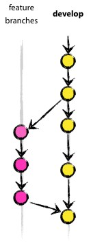
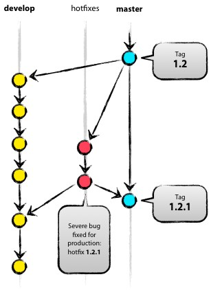

# Git 规范
Git 是当今世界上最先进的版本控制系统，对于码农来说是家喻户晓的东西，所以不会用的话绝对会被“呵呵”之。

为什么要用Git？好处估计不需要废话了，反正我们就是要求你必须用 - -!。

## 要求
* **组内每个成员都要熟练的使用 Git，做好代码管理** —— *不熟练怎么协作，谁爱跟你玩？*
* **放弃工具，使用命令行** —— *教程看完了还会觉得工具好用么？*
* **清楚分支管理规范，并严格遵循** —— *没有分支管理，还说个毛 Git？*

## 教程
关于 Git 的教程，网上多得数不清，而且关于 Git 的书籍也多得看不完，鉴于这种状况，向大家来推荐如下教程，相信看完之后一般问题是难不倒了，如果想深入研究，请自行学习。

* [git - 简明指南](http://rogerdudler.github.io/git-guide/index.zh.html)：一个非常简短的入门教程，能够带你快速的了解下 Git 和一些基本的命令
* [Git 教程（廖雪峰）](http://www.liaoxuefeng.com/wiki/0013739516305929606dd18361248578c67b8067c8c017b000)：网上的一个不错的教程，涵盖了我们平时常用的 Git 功能
* [Pro Git 中文版](https://git-scm.com/book/zh/v2/)：看完这本书，估计 Git 使用上是没啥问题了，当然其中有些章节可以不去深入了解

## 分支管理
分支管理可以认为是 Git 的精髓，关于分支管理的文章很多，但是基本上都是基于 Git Flow的。

### Git Flow 是什么
Git Flow 是构建在 Git 之上的一个组织软件开发活动的模型，是在 Git 之上构建的一项软件开发最佳实践。Git Flow 是一套使用 Git 进行源代码管理时的一套行为规范和简化部分 Git 操作的工具。

Git Flow 重点解决的是由于源代码在开发过程中的各种冲突导致开发活动混乱的问题。因此，Git flow 可以很好的于各种现有开发模型相结合使用。

开始学习之前，我们先看一下模型的全貌：

### Git Flow 中的分支
Git Flow 模型中定义了主分支和辅助分支两类分支。其中主分支用于组织与软件开发、部署相关的活动；辅助分支组织为了解决特定的问题而进行的各种开发活动。

#### 主分支
主分支是所有开发活动的核心分支。所有的开发活动产生的输出物最终都会反映到主分支的代码中。主分支分为 `master` 分支和 `development` 分支。

##### master 分支
master 分支上存放的应该是随时可供在生产环境中部署的代码（Production Ready state）。当开发活动告一段落，产生了一份新的可供部署的代码时，master 分支上的代码会被更新。同时，每一次更新，最好添加对应的版本号标签（TAG）。

##### develop 分支
develop 分支是保存当前最新开发成果的分支。通常这个分支上的代码也是可进行每日夜间发布的代码（Nightly build）。因此这个分支有时也可以被称作 “integration branch”。

当 develop 分支上的代码已实现了软件需求说明书中所有的功能，通过了所有的测试后，并且代码已经足够稳定时，就可以将所有的开发成果合并回 master 分支了。对于 master 分支上的新提交的代码建议都打上一个新的版本号标签（TAG），供后续代码跟踪使用。

因此，每次将 develop 分支上的代码合并回 master 分支时，我们都可以认为一个新的可供在生产环境中部署的版本就产生了。通常而言，“仅在发布新的可供部署的代码时才更新 master 分支上的代码”是推荐所有人都遵守的行为准则。基于此，理论上说，每当有代码提交到 master 分支时，我们可以使用 Git Hook 触发软件自动测试以及生产环境代码的自动更新工作。这些自动化操作将有利于减少新代码发布之后的一些事务性工作。

#### 辅助分支
辅助分支是用于组织解决特定问题的各种软件开发活动的分支。辅助分支主要用于组织软件新功能的并行开发、简化新功能开发代码的跟踪、辅助完成版本发布工作以及对生产代码的缺陷进行紧急修复工作。这些分支与主分支不同，通常只会在 **有限的时间范围内** 存在。

辅助分支包括：

* 用于开发新功能时所使用的 feature 分支
* 用于辅助版本发布的 release 分支
* 用于修正生产代码中的缺陷的 hotfix 分支

以上这些分支都有固定的使用目的和分支操作限制。从单纯技术的角度说，这些分支与 Git 其他分支并没有什么区别，但通过命名，我们定义了使用这些分支的方法。

##### feature 分支
使用规范：

* 可以从 develop 分支发起 feature 分支
* 代码必须合并回 develop 分支
* feature 分支的命名可以使用除 `master`，`develop`，`release-*`，`hotfix-*` 之外的任何名称

feature 分支（有时也可以被叫做“ topic 分支”）通常是在开发一项新的软件功能的时候使用，这个分支上的代码变更最终合并回 develop 分支或者干脆被抛弃掉（例如实验性且效果不好的代码变更）。

一般而言，feature 分支代码可以保存在开发者自己的代码库中而不强制提交到主代码库里。

##### release 分支
使用规范：

* 可以从 develop 分支派生
* 必须合并回 develop 分支和 master 分支
* 分支命名惯例：`release-*`

release 分支是为发布新的产品版本而设计的。在这个分支上的代码允许做小的缺陷修正、准备发布版本所需的各项说明信息（版本号、发布时间、编译时间等等）。通过在 release 分支上进行这些工作可以让 develop 分支空闲出来以接受新的 feature 分支上的代码提交，进入新的软件开发迭代周期。

当 develop 分支上的代码已经包含了所有即将发布的版本中所计划包含的软件功能，并且已通过所有测试时，我们就可以考虑准备创建 release 分支了。而所有在当前即将发布的版本之外的业务需求一定要确保不能混到release分支之内（避免由此引入一些不可控的系统缺陷）。

成功的派生了 release 分支，并被赋予版本号之后，develop 分支就可以为“下一个版本”服务了。所谓的“下一个版本”是在当前即将发布的版本之后发布的版本。版本号的命名可以依据项目定义的版本号命名规则进行。

##### hotfix 分支
使用规范：

* 可以从 master 分支派生
* 必须合并回 master 分支和 develop 分支
* 分支命名惯例：`hotfix-*`

除了是计划外创建的以外，hotfix 分支与 release 分支十分相似：都可以产生一个新的可供在生产环境部署的软件版本。

当生产环境中的软件遇到了异常情况或者发现了严重到必须立即修复的软件缺陷的时候，就需要从 master 分支上指定的 TAG 版本派生 hotfix 分支来组织代码的紧急修复工作。

这样做的显而易见的好处是不会打断正在进行的 develop 分支的开发工作，能够让团队中负责新功能开发的人与负责代码紧急修复的人并行的开展工作。

### 更进一步
Git Flow 开发模型从源代码管理角度对通常意义上的软件开发活动进行了约束。应该说，为我们的软件开发提供了一个可供参考的管理模型。Git Flow 开发模型让开发代码仓库保持整洁，让小组各个成员之间的开发相互隔离，能够有效避免处于开发状态中的代码相互影响而导致的效率低下和混乱。

所谓模型，在不同的开发团队，不同的文化，不同的项目背景情况下都有可能需要进行适当的裁剪或扩充。

针对我们现在的情况，可以考虑暂时不使用 release 分支。

***
## **请大家仔细阅读，积极思考，有问题及时讨论**