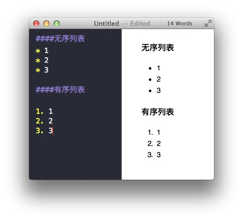

# Markdown 入门指南

## 一、认识 Markdown

### 1. Markdown 简介
Markdown 是一种用来写作的轻量级「标记语言」，它用简洁的语法代替排版，而不像一般我们用的字处理软件 Word 或 Pages 有大量的排版、字体设置。它使我们专心于码字，用「标记」语法，来代替常见的排版格式。目前来看，支持 Markdown 语法的编辑器有很多，包括很多网站（例如 [GitHub](http://www.github.com) ）也支持了 Markdown 的文字录入。Markdown 从写作到完成，导出格式随心所欲，你可以导出 HTML 格式的文件用来网站发布，也可以十分方便的导出 PDF 格式。Markdown 目前越来越受到文档写作者的推崇。

### 2. Markdown 官方文档
> - [Markdown 语法官方文档](http://daringfireball.net/projects/markdown/syntax)
> - [Markdown 语法说明中文版](http://wowubuntu.com/markdown/)

### 3. Markdown 的优点
- 专注你的文字内容而不是排版样式，安心写作
- 轻松的导出 HTML、PDF 和本身的 .md 文件
- 纯文本内容，兼容所有的文本编辑器与文字处理软件
- 随时修改你的文章版本，不必像文字处理软件生成若干文件版本导致混乱
- 可读、直观、学习成本低

### 4. Markdown 工具
- Mac OS 上推荐使用 [Mou](http://25.io/mou/)
- Windows 上有[haroopad]()、 [MarkdownPad](http://www.markdownpad.com/) 和 [MarkPad](http://code52.org/DownmarkerWPF/) 等，可供选择的比较多
- Web在线，可以使用 [简书](http://www.jianshu.com)

## 二、Markdown 常用语法简介

### 1. 段落（换行）
换行有两种方式：

- 在需要换行的行末使用 “两个空格 ＋ 回车” 的方式
- 在需要换行的行末使用 “两个回车” 的方式

### 2. 标题
标题采用 \# 加 “标题” 的形式，共分为 1 ～ 6 级标题。

### 3. 列表
无序列表的显示只需要在文字前加上 \- 或 \* 即可变为无序列表，有序列表则直接在文字前加1. 2. 3. 符号要和文字之间加上一个字符的空格。

### 4. 引用
在要引用的文本前加入 \> （大于号）即可实现引用效果，引用可以和其他语法嵌套使用。

### 5. 链接和图片
链接和图片是写文档时比较常用的，他们的语法很像：

- 链接为：\[ 链接对应的名称 \] \( 链接的URL \)
- 图片为：\! \[ 图片对应的名称 \] \( 图片的路径或URL \)

### 6. 粗体和斜体
用两个 * 包含一段文本就是粗体的语法，用一个 * 包含一段文本就是斜体的语法。

例如：**这里是粗体**，*这里是斜体*

### 7. 代码块
代码块用一个 Tab （制表符）或者四个空格

	func helloWorld() {
		print("Hello world.")
	}
	
如果要标记一小段行内代码，你可以用 “ \` ” 反引号把它包起来，例如：

> Use the `print()` function.

### 8. 分割线
分割线的语法只要三个 \* 号， 如：
***

### 9. 表格
Markdown 语法：

	| ABCD | EFGH | IJKL |
	| -----|:----:| ----:|
	| a    | b    | c    |
	| d    | e    | f    |
	| g    | h    | i    |

展示效果：

| ABCD | EFGH | IJKL |
| -----|:----:| ----:|
| a    | b    | c    |
| d    | e    |  f   |
| g    | h    |   i  |

注意：对齐方式的语法。

### 转义字符
在特殊字符，如 * 、[ 、> 等前面加 \ 可使特殊格式字符转换为正常字符打出（有序列表符号如 1. ，须在 . 前加 \ ）。

需要转义的字符有：
	\
	`
	*
	_
	{}
	[]
	()
	#
	+
	-
	.
	!
