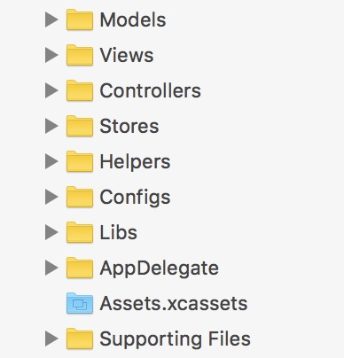

# iOS 项目规范

## 前言
本文档提出一种开发iOS项目的规范方式，目的在于规范组内的开发习惯，让大家尽可能的愉快合作。

规范是由大家共同确认制定的，是会随着团队不断的进步而演进的，规范也是需要靠每个成员用心维护，在任何时候有了改动或者新的补充，都需要经过大家确认后，及时补充进来。

## 规范说明

### 编译器
编译器统一使用 `Xcode`，并且要求从 `App Store` 下载。

### 写 views 的方式
关于在做 views 的时候，是用纯代码方式，还是 `Storyboards` 和 `XIB`方式的争论从未停止过，从便于团队合作的角度出发，建议如下：

以代码为主，`XIB` 为辅的方式开发，不建议使用 `Storyboards`。可以在编写某些特殊的自定义 view 时采用 `XIB` 的方式。

### Ignores
第一次提交代码前必须添加 ignore 文件，

第一次提交代码前必须添加 ignore 文件，

第一次提交代码前必须添加 ignore 文件，

重要的事情说三遍，采用 GitHub 提供的 [Swift](https://github.com/github/gitignore/blob/master/Swift.gitignore) 或者 [OC](https://github.com/github/gitignore/blob/master/Objective-C.gitignore) 版本即可。

### 依赖管理
使用 `Cocoa Pods` 做依赖管理，安装及使用的教程很多，不赘述，可参考[这篇](http://www.cocoachina.com/swift/20150630/12305.html)。

### 项目结构
目前我们遵循 `M-V-C-S` 架构，目录结构如下：

* `Models` `Views` `Controllers` 三个文件夹
* `Stores` 为本地化存储（包括 `NSUserDefaults` `DataBase` 等）、网络（可视为远程存储）、缓存等操作所需文件
* `Helpers` 为工具类，多为全局操作
* `Configs` 中放一切全局常量相关（字体、颜色、尺寸、URL等，分文件放）
* `Libs` 放第三方库

备注：项目结构是根据采用的架构不同而变化的，制定是合理方便即可。

### 常量
控制常量的作用范围，越小越好。 `class` 中使用的常量（包括 `enum` 类型），写在当前class中，并定义成 `private`；全局使用的常量，写在专门的文件中，用 `struct` 来区分，以便方便的使用。

	struct Config {
    	static let baseURL: NSURL(string: "http://www.example.org/")!
	    static let splineReticulatorName = "foobar"
	}

	struct Color {
    	static let primaryColor = UIColor(red: 0.22, green: 0.58, blue: 0.29, alpha: 1.0)
	    static let secondaryColor = UIColor.lightGrayColor()
	}

### 常用第三方库

#### 网络相关
* 网络：[Alamofire](https://github.com/Alamofire/Alamofire)
* JSON解析：[SwiftyJSON](https://github.com/SwiftyJSON/SwiftyJSON)

#### UI相关
* 自动布局：[SnapKit](https://github.com/SnapKit/SnapKit)
* 滑动分页：[DLSlideView](https://github.com/agdsdl/DLSlideView)

#### 工具相关
* 下拉／上拉刷新：[MJRefresh](https://github.com/CoderMJLee/MJRefresh)
* 菊花加载：[MBProgressHUD](https://github.com/jdg/MBProgressHUD)
* 图片异步加载：[Kingfisher](https://github.com/onevcat/Kingfisher)
* 相机／相册工具：[ALCameraViewController](https://github.com/AlexLittlejohn/ALCameraViewController)

#### Hybrid相关
* JSBridge：[WebViewJavascriptBridge](https://github.com/marcuswestin/WebViewJavascriptBridge)

### 架构
几种机构方式：

* Model-View-Controller-Store(MVCS)
* Model-View-ViewModel(MVVM)
* View-Interactor-Presenter-Entity-Routing (VIPER)

目前我们采用的架构方式为 `MVCS` ，在官方 `MVC` 架构的基础上扩展出了 `Store` 层，用于跟存储、网络、缓存等相关操作的封装。

注意：

* `Model` ：可以用 `struct` 做好数据结构，可以用 SwiftyJSON 来实现 JSON 和 Model 的映射，来方便的处理 API 调用。
* `Controller` ：将其所需的所有条件在初始化函数中定义好，避免遗漏造成 bug。

如：

	let fooViewController = FooViewController(viewModel: fooViewModel)
* `Store`：对本地化存储、缓存、网络的封装，如网络的封装可以用回调或者代理的方式。

### 事件模式
常见的事件通知模式有几种：

* 代理( Delegation )：一对一模式
* 回调( Callback blocks )：一对一模式
* 通知中心( Notification Center )：一对多
* 观察者( KVO )：一对多
* 信号( Signals )：一对多

### 关于图片
用好 `Assets` 来管理图片资源，不要用老式方法。

***
***目前就想到这么多，后续再补充***